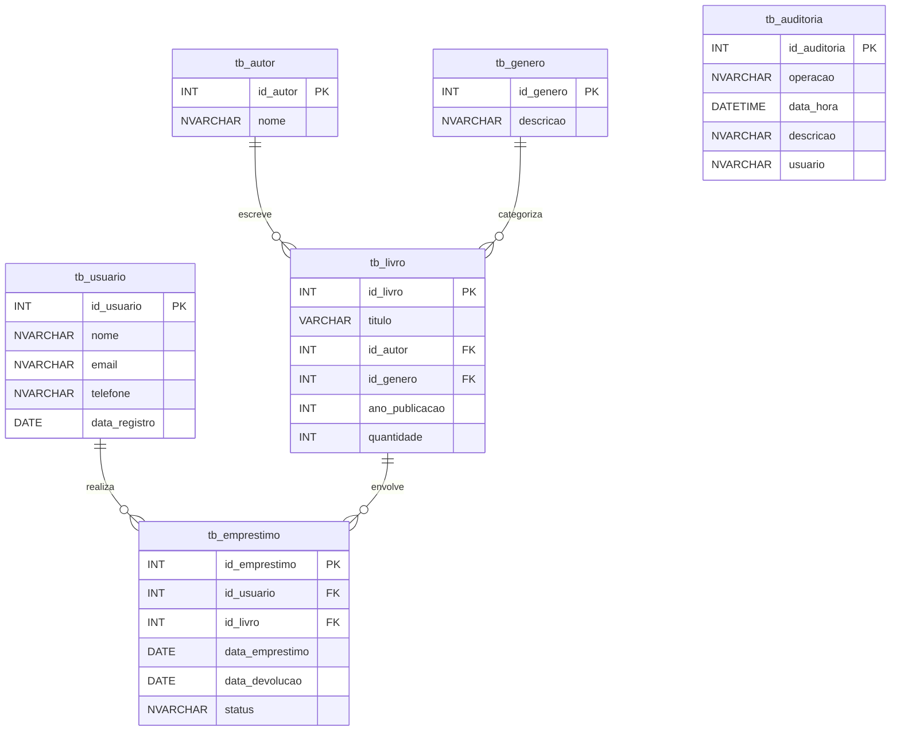

# Documentação - Banco de Dados Biblioteca

O banco de dados implementado para a aplicação de biblioteca foi projetado para gerenciar usuários, autores, gêneros literários, livros e empréstimos, garantindo integridade e facilidade de manutenção. Ele inclui tabelas principais como tb_usuario, tb_autor, tb_genero, tb_livro, e tb_emprestimo, além de uma tabela de auditoria (tb_auditoria) para rastreamento de operações sensíveis.

Os relacionamentos são estabelecidos com chaves estrangeiras que asseguram a integridade referencial. Por exemplo, os empréstimos estão diretamente associados aos usuários e livros, enquanto cada livro é vinculado a um autor e a um gênero. Também foram criadas views, gatilhos e procedimentos armazenados para facilitar operações complexas e oferecer maior controle sobre os dados.

Abaixo, a representação lógica das tabelas e seus relacionamentos em formato de diagrama:





## Gatilhos, Procedures Views e Consultas

### Gatilhos

#### Criação do gatilho `trg_audit_emprestimo` para auditoria de operações na tabela `tb_emprestimo`


Esse gatilho (trg_audit_emprestimo) é acionado automaticamente após operações de inserção, atualização ou exclusão na tabela tb_emprestimo. Ele registra essas ações na tabela de auditoria (tb_auditoria), incluindo detalhes como tipo de operação, ID do empréstimo e usuário que realizou a alteração. Gatilhos servem para monitorar e automatizar ações no banco de dados, ajudando na manutenção de registros e na integridade dos dados.


```sql
CREATE TRIGGER trg_audit_emprestimo
ON tb_emprestimo
AFTER INSERT, UPDATE, DELETE
AS
BEGIN
    IF EXISTS (SELECT * FROM INSERTED)
    BEGIN
        INSERT INTO tb_auditoria (operacao, descricao, usuario)
        SELECT 'INSERT', 
               CONCAT('Empréstimo ID ', id_emprestimo, ' foi inserido'),
               SUSER_NAME()  
        FROM INSERTED;
    END

    IF EXISTS (SELECT * FROM INSERTED) AND EXISTS (SELECT * FROM DELETED)
    BEGIN
        INSERT INTO tb_auditoria (operacao, descricao, usuario)
        SELECT 'UPDATE', 
               CONCAT('Empréstimo ID ', id_emprestimo, ' foi atualizado'),
               SUSER_NAME() 
        FROM INSERTED;
    END

    IF EXISTS (SELECT * FROM DELETED)
    BEGIN
        INSERT INTO tb_auditoria (operacao, descricao, usuario)
        SELECT 'DELETE', 
               CONCAT('Empréstimo ID ', id_emprestimo, ' foi excluído'),
               SUSER_NAME()  
        FROM DELETED;
    END
END;
```

#### Criação de procedure `GetEmprestimosCliente ` para automação de consultas

A procedure GetEmprestimosCliente automatiza a consulta de empréstimos feitos por um cliente específico, retornando dados como a data do empréstimo, status de devolução, título do livro e e-mail do usuário. Isso simplifica e padroniza as consultas complexas no banco de dados. Procedures são usadas para encapsular lógica de consultas ou manipulações, melhorando a reutilização e segurança no acesso aos dados.


```sql
ALTER PROCEDURE GetEmprestimosCliente 
    @cliente NVARCHAR(100)
AS
BEGIN
    SELECT 
	  e.data_emprestimo AS data_da_aquisicao,
	  e.status AS devolucao,
	  l.titulo AS livro,
	  u.email
	FROM tb_emprestimo e 
	     join tb_usuario u on  e.id_usuario = u.id_usuario
		 join tb_livro l on e.id_livro = l.id_livro
    WHERE u.nome = @cliente; 
END


EXEC GetEmprestimosCliente @cliente = 'Rodrigo Azevedo';
```


#### Criação de views `vw_status_emprestimo ` para automação e segurança 

A view vw_status_emprestimo apresenta uma visão consolidada dos empréstimos, incluindo informações como o número de cadastro do cliente, nome, título do livro, data de locação e data de devolução. Ela facilita a visualização de dados relacionados sem a necessidade de recriar consultas complexas. Views são úteis para simplificar consultas e melhorar a legibilidade ao encapsular lógicas frequentes de acesso a dados.


```sql
 CREATE VIEW vw_status_emprestimo AS
  SELECT
   u.id_usuario as numero_cadastro,
   u.nome as cliente,
   l.titulo as livro,
   e.data_emprestimo as data_de_locacao,
   e.data_devolucao
 FROM tb_usuario u
       JOIN tb_emprestimo e ON u.id_usuario = e.id_usuario
	   JOIN tb_livro l on e.id_livro = l.id_livro;


 DROP VIEW IF EXISTS vw_status_emprestimo;

 SELECT * from vw_status_emprestimo;  
```


