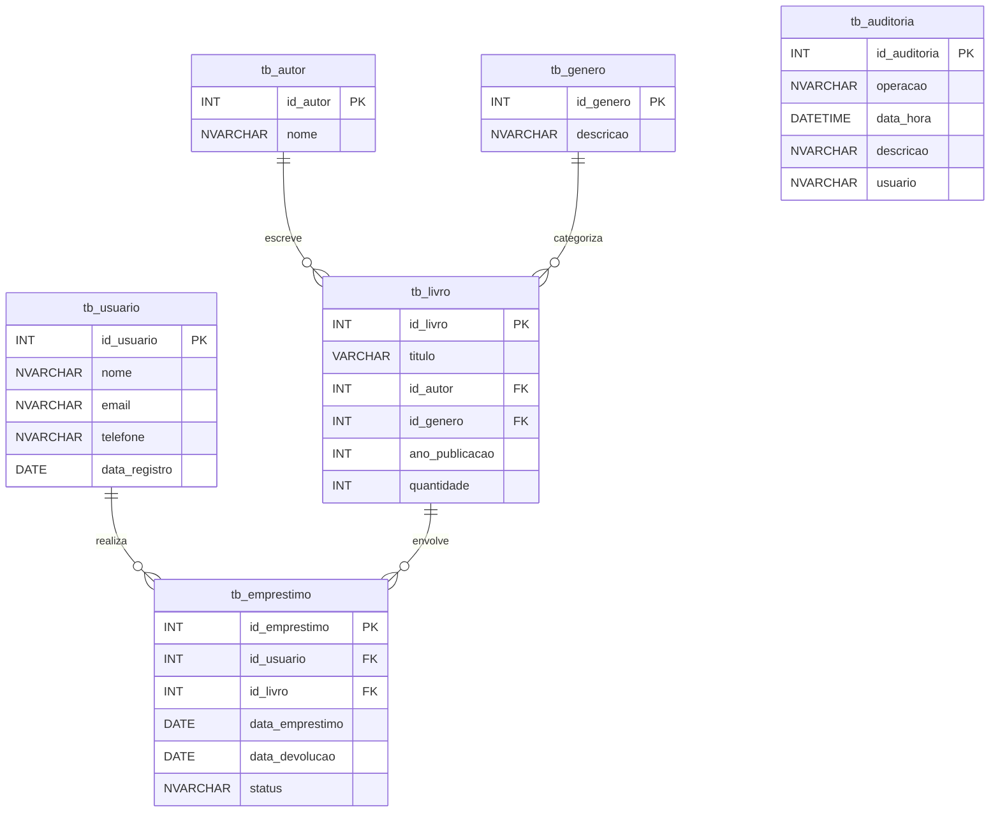

# Documentação - Banco de Dados Biblioteca

O banco de dados implementado para a aplicação de biblioteca foi projetado para gerenciar usuários, autores, gêneros literários, livros e empréstimos, garantindo integridade e facilidade de manutenção. Ele inclui tabelas principais como tb_usuario, tb_autor, tb_genero, tb_livro, e tb_emprestimo, além de uma tabela de auditoria (tb_auditoria) para rastreamento de operações sensíveis.

Os relacionamentos são estabelecidos com chaves estrangeiras que asseguram a integridade referencial. Por exemplo, os empréstimos estão diretamente associados aos usuários e livros, enquanto cada livro é vinculado a um autor e a um gênero. Também foram criadas views, gatilhos e procedimentos armazenados para facilitar operações complexas e oferecer maior controle sobre os dados.

Abaixo, a representação lógica das tabelas e seus relacionamentos em formato de diagrama:





## Gatilhos, Procedures e Consultas

### Gatilhos

#### Criação do gatilho `trg_audit_emprestimo` para auditoria de operações na tabela `tb_emprestimo`
```sql
CREATE TRIGGER trg_audit_emprestimo
ON tb_emprestimo
AFTER INSERT, UPDATE, DELETE
AS
BEGIN
    IF EXISTS (SELECT * FROM INSERTED)
    BEGIN
        INSERT INTO tb_auditoria (operacao, descricao, usuario)
        SELECT 'INSERT', 
               CONCAT('Empréstimo ID ', id_emprestimo, ' foi inserido'),
               SUSER_NAME()  
        FROM INSERTED;
    END

    IF EXISTS (SELECT * FROM INSERTED) AND EXISTS (SELECT * FROM DELETED)
    BEGIN
        INSERT INTO tb_auditoria (operacao, descricao, usuario)
        SELECT 'UPDATE', 
               CONCAT('Empréstimo ID ', id_emprestimo, ' foi atualizado'),
               SUSER_NAME() 
        FROM INSERTED;
    END

    IF EXISTS (SELECT * FROM DELETED)
    BEGIN
        INSERT INTO tb_auditoria (operacao, descricao, usuario)
        SELECT 'DELETE', 
               CONCAT('Empréstimo ID ', id_emprestimo, ' foi excluído'),
               SUSER_NAME()  
        FROM DELETED;
    END
END;
```

#### Criação do gatilho `trg_audit_emprestimo` para auditoria de operações na tabela `tb_emprestimo`


